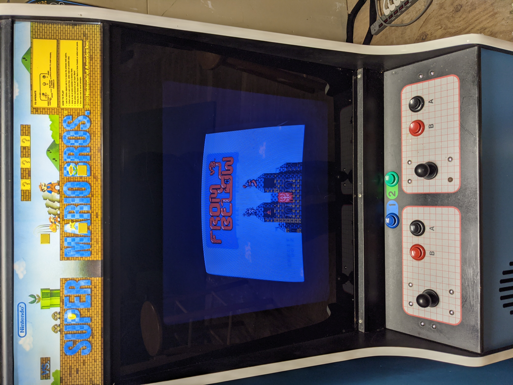

# Nintendo VS.



- [John's Arcade Nintendo VS. Page](http://johnsarcade.com/nintendo_vs_ppu_info.php)
- [From Below: the first new Nintendo VS. game in 30+ years](https://mhughson.itch.io/from-below/devlog/206464/vs-system-beta-080)
- [2600's Hacked VS. Roms](https://forums.arcade-museum.com/threads/2600s-hacked-roms-for-the-nintendo-vs-system-and-multivs-pcb.375524/)
- [Matt Osborne's VS. Super Mario Brothers high score save/freeplay hack](http://www.scoresaves.com/VsSMBHSFP.html)

## Game/PPU Charts

### Unisystem games (no gun, no daughterboard)

|**RP2C04-0001**|**RP2C04-0002**|**RP2C04-0003**|**RP2C04-0004**|**RC2C03B**|**RC2C05-01**|**RC2C05-02**|
|-|-|-|-|-|-|-|
|Battle City<sup>1</sup>|Battle City<sup>1</sup>|Battle City<sup>1</sup>|Battle City<sup>1</sup>|||
||||Clu Clu Land|||
|Excite Bike<sup>2</sup>|Excite Bike<sup>2</sup>|Excite Bike|Excite Bike<sup>2</sup>|Excite Bike<sup>2</sup>||
||||Excite Bike (Japan)|||
|From Below<sup>1</sup>|From Below<sup>1</sup>|From Below<sup>1</sup>|From Below<sup>1</sup>|From Below<sup>1</sup>||
|Golf|||||
||||Ice Climber|||
|Mach Rider (Japan)||||||
|Mighty Bomb Jack<sup>2</sup>|Mighty Bomb Jack<sup>2</sup>|Mighty Bomb Jack<sup>2</sup>|Mighty Bomb Jack<sup>2</sup>|Mighty Bomb Jack<sup>2</sup>||Mighty Bomb Jack|
|||||Ninja Jajamaru-Kun<sup>2</sup>|Ninja Jajamaru-Kun||
|Pinball (US)||||||
|Slalom (needs special controller)|||||
||||Skate Kid|||
|||Soccer||||
|Star Luster<sup>1</sup>|Star Luster<sup>1</sup>|Star Luster<sup>1</sup>|Star Luster<sup>1</sup>|Star Luster<sup>1</sup>||
|Super Mario Bros.<sup>2</sup>|Super Mario Bros.<sup>2</sup>|Super Mario Bros.<sup>2</sup>|Super Mario Bros.|Super Mario Bros.<sup>2</sup>||
|Tetris<sup>1</sup>|Tetris<sup>1</sup>|Tetris<sup>1</sup>|Tetris<sup>1</sup>|Tetris<sup>1</sup>||

**<sup>1</sup> - Dip switch setting**
**<sup>2</sup> - Hacked ROM**

## MultiVS ROM Information

[Nintendo Multi VS Lite Multigame Kit](https://highscoresave.com/nintendo-multi-vs-lite-multigame-kit/)

The installation guide has the Windows commands for creating a combined 8-in-1 image:

> - Consider the first half of a VS board. There are 6 EPROM Sockets. The 6 EPROM sockets can be divided into 2 groups. Group 1 = 1A,1B,1C, and
1D and Group 2 = 2A and 2B.
> - All the game EPROMs from Group 1 for each game are combined into 1 larger EPROM in spot U2.
> - All the Game EPROMs for Group 2 for each game are combined into 1 larger EPROM in spot U5.
> - A simple way to create each game group is to use the command line.
> - Assuming your games are in the same directory, you would enter this from the command line to create game1's group into a file called game1group1.bin and game1group2.bin copy /b game1.1a + game1.1b +
game1.1c + game1.1d game1group1.bin copy /b game1.2a + game1.2b game1group2.bin
> - If a game doesn't contain an eprom in all 6 spots then you must use another EPROM image in it's place when creating the group ERPOM.
> - For example, VS Mighty Bomb Jack doesn't have a 2a ERPOM so to create a combined group 2 eprom you would type: copy /b 2b.bin + 2b.bin vsmightybombjackgroup2.bin
> - After you've created groups for each game, you then can create the combined EPROM for U2 and U5. copy /b game1group1.bin + game2group1.bin + game3group1.bin + game4group1.bin +
game5group1.bin+ game6group1.bin + game7group1.bin + game8group1.bin U2.bin> The above creates an image for a 2Mb EPROM called “U2.bin”. copy /b game1group2.bin+ game2group2.bin + game3group2.bin + game4group2.bin + game5group2.bin+ game6group2.bin + game7group2.bin + game8group2.bin U5.bin The above creates an image for a 1Mb EPROM called “U5.bin”.
> - If using a 2Mb EPROM like in the suggested Bill of Materials then you will need to do the following. Copy /b U5.bin + U5.bin U5_doubled.bin This creates an image for a 2Mb EPROM called “U5_doubled.bin”.

Bash commands to split 8 sets of ROMs from a MultiVS U2.bin and U5.bin:

```bash
#!/bin/bash
  
for rom in {0..7}
do
  dd if=U2.bin ibs=1 skip=$(($rom*32768)) count=32768 of=u2-rom-$(($rom+1)).bin
  dd if=U5.bin ibs=1 skip=$(($rom*16384)) count=16384 of=u5-rom-$(($rom+1)).bin
done
```

Bash command to recombine them. This assumes 2MB EPROMS, so U5.bin has to be doubled:

```bash
cat u2-rom-1.bin u2-rom-2.bin u2-rom-3.bin u2-rom-4.bin u2-rom-5.bin u2-rom-6.bin u2-rom-7.bin u2-rom-8.bin > U2.bin
cat u5-rom-1.bin u5-rom-2.bin u5-rom-3.bin u5-rom-4.bin u5-rom-5.bin u5-rom-6.bin u5-rom-7.bin u5-rom-8.bin > U5-half.bin
cat U5-half.bin U5-half.bin > U5.bin
```

Bash commands to split the 8 ROMs from PPU 0004 Standard #2 (Ice Climber, Excitebike, SMB, Pinball, Tetris, Battle City, Skate Kid, Clu Clu Land), naming each one accordingly:

```bash
#!/bin/bash
  
dd if=U2.bin ibs=1 skip=0 count=32768 of=u2-ice.bin

dd if=U2.bin ibs=1 skip=32768 count=32768 of=u2-excite.bin
dd if=U2.bin ibs=1 skip=65536 count=32768 of=u2-smb.bin
dd if=U2.bin ibs=1 skip=98304 count=32768 of=u2-pinball.bin
dd if=U2.bin ibs=1 skip=131072 count=32768 of=u2-tetris.bin
dd if=U2.bin ibs=1 skip=163840 count=32768 of=u2-battle.bin
dd if=U2.bin ibs=1 skip=196608 count=32768 of=u2-skate.bin
dd if=U2.bin ibs=1 skip=229376 count=32768 of=u2-clu.bin
dd if=U5.bin ibs=1 skip=0 count=16384 of=u5-ice.bin
dd if=U5.bin ibs=1 skip=16384 count=16384 of=u5-excite.bin
dd if=U5.bin ibs=1 skip=32768 count=16384 of=u5-smb.bin
dd if=U5.bin ibs=1 skip=49152 count=16384 of=u5-pinball.bin
dd if=U5.bin ibs=1 skip=65536 count=16384 of=u5-tetris.bin
dd if=U5.bin ibs=1 skip=81920 count=16384 of=u5-battle.bin
dd if=U5.bin ibs=1 skip=98304 count=16384 of=u5-skate.bin
dd if=U5.bin ibs=1 skip=114688 count=16384 of=u5-clu.bin
```
Bash commands to recombine them and put SMB first (assumes 2MB EPROMS):

```bash
cat u2-smb.bin u2-excite.bin u2-tetris.bin u2-skate.bin u2-ice.bin u2-pinball.bin u2-battle.bin u2-clu.bin > U2.bin
cat u5-smb.bin u5-excite.bin u5-tetris.bin u5-skate.bin u5-ice.bin u5-pinball.bin u5-battle.bin u5-clu.bin > U5-half.bin
cat U5-half.bin U5-half.bin > U5.bin
```
